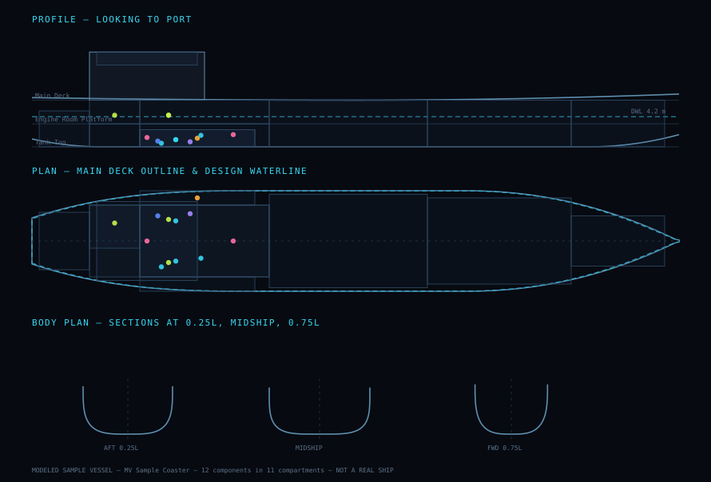

# DryDock

Interactive 3D digital twin for shipboard maintenance decision support.

Select a component of the vessel, mark it as failed, and the application answers
four questions: **what else goes down with it**, **what sits in danger nearby**,
**what has to come apart to reach it**, and **how urgent the repair is**.



---

## Honesty first

This matters more than any feature, so it comes before them.

The vessel is a **modeled sample vessel**. Its hull form, compartment layout,
component list, materials, repair times and dependency network are a documented
simulation built for this demo. They are not measurements of any real ship, they
were not validated by a naval architect or a chief engineer, and they must not be
used for engineering decisions. Every component in the data carries a `note`
field recording what was modelled and on what basis, and the disclaimer is shown
permanently in the interface — not buried in this file.

The waterfront around the vessel — Rio de Janeiro by day or by night, with
boats and aircraft — is scenery, generated in code. It follows the real skyline and uses
the real heights of the landforms, but it is a stylised reconstruction, not
survey data: no elevation model, no real buildings, and distances compressed
to fit the view.

What *is* real is the analysis. The impact cascade, the access path and the
urgency score are computed by an actual graph engine running over the model, not
scripted or pre-baked. Point it at a different dataset and it will produce a
different answer.

No external 3D or image assets are used. The hull is generated procedurally
from a parametric description, the surface textures are baked by a script in
this repository from seeded noise, and the sky is an atmospheric model — so
there are no model files and no photographs. The two small images the interface
animations use are drawn by a script here too. The one piece of third-party
source in the repository is a set of React Bits interface components, credited
and licensed as described under [Interface animations](#interface-animations-react-bits).

---

## What the engine does

### Impact analysis — which systems fall over

The dependency graph is directed, and every edge carries a **resource kind**
(electrical power, fuel, cooling, sea water, mechanical drive, …). That
distinction is what makes the result defensible:

> A component needs **all** of the resource kinds it consumes, but within one
> kind **any** live supplier is enough.

So losing cooling stops the main engine even though its fuel supply is intact,
while losing one of two parallel generators does not black out the switchboard.

Propagation uses a live-supplier counter per `(component, resource)` pair — the
shape of Kahn's algorithm, run breadth-first from the failure. Each edge is
visited at most once, so the traversal is `O(V + E)`, and feedback loops (the
switchboard powers the fuel separator that fuels the generators that feed the
switchboard) need no special case: a component can only be lost once.

Every lost component records its **depth** (how many hops from the failure) and
its **cause** (the supplier and resource that starved it), which the interface
uses to play the cascade out wave by wave and to draw a link from cause to
effect. Consumers that lost a supplier but kept running on another are reported
as *held by redundancy*. Code: `lib/engine/impact.ts`.

### Access path — what has to come apart

A second, separate graph (`lib/data/access.json`, 92 nodes): the gangway, deck
walkways, doors, hatches, ladders, floor plates, spool pieces and guards, and
the work face of every component. Walking an edge costs its length at 0.8 m/s;
entering a node costs that node's own minutes — undogging a door, lifting floor
plates, removing a spool, isolating at the work face. The route is a
**Dijkstra** search with a binary heap from the gangway (`lib/engine/access.ts`).

Dijkstra rather than breadth-first search because the weights are wildly
uneven: a four-minute walk round the deck can beat a shortcut through a tank
that needs four hours of gas-freeing. Some routes pass *through other
equipment* — the central cooler's end cover cannot be swung until the
fresh-water pump's discharge spool is removed — and those components are named.
Everything marked for refitting feeds the reassembly time.

The two graphs are deliberately kept apart: a pump can depend electrically on a
switchboard two decks away while being physically buried under something else
entirely.

### Repair plan and collateral risk

`lib/engine/repair.ts` lays the job out end to end — access and opening up,
isolation and permits, the repair itself, reassembly, testing — and states what
the material allows on board (cast iron is not welded at sea; steel is, under a
hot-work permit). `lib/engine/proximity.ts` scans the neighbours within 6 m for
physical danger: sea water reaching electrical gear below a flooding leak, fuel
spray landing on a hot surface, arc-flash and burst radii.

### Urgency score — and why it says what it says

A decision-support tool that emits an unexplained number is theatre. The score
is a plain sum of six factors, each with a stated maximum and a sentence saying
why it scored what it did (`lib/engine/urgency.ts`):

| Factor | Max | How |
| --- | ---: | --- |
| Component criticality | 25 | criticality / 5 × 25 |
| Cascade | 25 | 25 × (1 − e^(−Σ criticality of lost components / 18)) |
| Vital functions | 20 | propulsion 12, steering 12, blackout 10, bilge / fire pumping 6 (capped) |
| Time to restore | 12 | 12 × min(1, hours from gangway to handover / 24) |
| Logistics | 10 | no spare 6, hot-work permit 2, system shutdown 2 |
| Hazards & collateral | 8 | from hazards at the work face and neighbours at high risk |
| Standby credit | −15 | a manual standby the crew can start |

Critical ≥ 75 · High ≥ 50 · Moderate ≥ 25 · Low below. The weights are a
documented modelling choice for this sample vessel, not an industry standard.

Note the distinction the model draws between two kinds of backup: **automatic
redundancy** (two components supplying the same resource kind to the same
consumer — the cascade simply does not happen) and a **manual standby** (listed
in `backedUpBy` — the cascade *does* happen until the crew changes over, but the
urgency is reduced and the standby is named in the repair card).

---

## Data model

Everything lives in typed JSON under `lib/data/`, validated by Zod at load time
and then cross-checked for referential integrity — unknown system ids, dangling
dependency edges, self-references, sources that supply nothing, and components
whose coordinates fall outside the compartment they claim to be in. A broken
model fails loudly at startup instead of silently producing an empty graph. A
test also checks every component against the hull itself (`tests/hullFit.test.ts`):
each corner of its bounding box must lie inside the shell at that height —
inside the deck edge for deck gear — with the few things that really do hang
outboard (propeller, rudder, lifeboats in their davits, crane jibs) listed as
exceptions.

```jsonc
{
  "id": "PMP-SW-01",
  "name": "Sea Water Cooling Pump No.1 (duty)",
  "systemId": "SYS-COOL",
  "compartmentId": "CMP-ER-LOWER",
  "position": { "x": -25, "y": 1.0, "z": 2.8 },
  "geometry": { "kind": "cylinder", "radius": 0.45, "height": 1.1, "axis": "y" },
  "material": "bronze-b62",
  "criticality": 4,
  "isSource": false,
  "feeds": [{ "to": "HX-CENTRAL-01", "resource": "seawater" }],
  "backedUpBy": ["PMP-SW-02"],
  "accessNodeId": "AN-ER-PUMP-BAY",
  "hazards": ["flooding"],
  "repair": { "meanRepairMinutes": 180, "replaceMinutes": 420, "crewRequired": 2, "…": "…" },
  "note": "Modeled: duty centrifugal SW pump, bronze casing…"
}
```

`dependsOn` is never written by hand — it is derived by inverting `feeds`, so the
two directions cannot contradict each other.

### Coordinate system

Shared by the data files and the 3D scene, declared once in
`components/scene/sceneConfig.ts`:

| Axis | Direction              | Origin              |
| ---- | ---------------------- | ------------------- |
| +X   | forward (towards bow)  | amidships           |
| +Y   | up                     | baseline / keel = 0 |
| +Z   | starboard              | centreline          |

One unit is one metre.

---

## The 3D view

The hull is a **loft**. Transverse sections are generated along the length as
superellipses running from the keel to the deck edge:

```
z(u) = halfBeam · sin(θ) ^ (2/n)
y(u) = keel + (deck − keel) · (1 − cos(θ) ^ (2/n)),   θ = u·π/2
```

The exponent `n` controls fullness — high values give the boxy midship section
of a cargo vessel, low values the fine V of the entrance. Sweeping `n`, the
half-beam, the sheer and the keel rise along the length produces a recognisable
ship from pure maths. Deck plates are cut from the same equations, inverted in
closed form, so they end exactly at the shell instead of poking through it.

### Materials, sky and sea

The look aims at a photographed ship, not a maquette. Three things carry it:

**Surfaces.** Every hull, deck and machinery material is three.js's standard
physically based material with a small shader extension
(`components/scene/pbr/surfaceMaterial.ts`). Textures are projected
*triplanar* in object space, in metres — no geometry needs UVs, every part gets
the same texel density, and a deck keeps its texture as it slides apart. Paint
is a dielectric (metalness 0) and only bare metal is metallic. On top of the
paint, baked masks add rust streaks running down from welds, grime, chipped
paint showing red-oxide primer, and a scum line at the waterline, scaled per
surface and broken up by non-repeating noise so the 9.6 m hull tile never reads
as a tile. The hull's paint scheme (antifouling, boot top, topsides) is applied
by height in the shader, so the boundaries are crisp.

**Textures.** `scripts/textures/bake.py` (numpy/scipy) generates four tileable
sets — hull plating with strakes, butts, weld beads and plate dishing between
frames; non-skid deck coating; cast and enamelled machinery; worked bare metal —
plus a wind-chop normal map from a Phillips wave spectrum and a foam texture.
Each set is a normal map, a packed AO/roughness/albedo map and a packed
rust/grime/chip map, written as WebP to `public/textures` (≈ 6 MB in total).
Being generated, they are reproducible and free of any licence.

```
python3 scripts/textures/bake.py public/textures
```

**Sky and light.** The sky is the Preetham atmospheric scattering model with a
cloud layer (three.js `Sky`, MIT), plus a low cloud band of our own. The
visible sky is evaluated for every pixel of the screen, drawn last at the far
plane so only uncovered pixels pay (about a millisecond on a laptop GPU), and
dithered: a cube map, however large, puts each texel across several pixels of
a high-density display, so clouds go blocky and night gradients step into
bands. The same atmosphere is also rendered into small cube maps — one the
coast samples for its haze, one that, prefiltered, is the image-based light. Photographed CC0 HDRIs were tried and rejected: all of them
were shot on land, and trees or buildings on the horizon of an open-sea scene
give it away. One shadow-casting directional light matches the sky, and the sun
gets a hot core, a halo and screen-space lens ghosts that fade when the hull
eclipses it. The lighting copy of the sky leaves out the bright halo around the
sun, because image-based light is never shadowed.

**Day and night** (`components/scene/daylight.ts`). A switch in the header, in
the manner of a phone's appearance toggle, changes the time of day — and the
scene does not cut: in about seven seconds the afternoon sun (behind and left
of the opening camera, raking across the waterfront) travels over the city,
lingers at the sunset over the open water beside the Pão de Açúcar, goes down
through the blue hour and leaves a moonlit night; switching back, it comes up
out of the sea to the east. One number (the phase) drives everything, and every other quantity —
sun direction and colour, the key light, exposure, sky and reflection strength,
aerial haze, how lit the city is — is a function of the sun's elevation,
evaluated once per frame into a shared object that the sky, the sea, the coast,
the boats, the aircraft and the ship's lights read. The stock sky model has no
night, so its shader is extended with the afterglow of the blue hour, a dark
sky brighter at the horizon, the orange dome of light over the city, the
moon's glow, and clouds lit from below by the city and from above by the moon.
Stars and the moon's disc are not baked into the cube map, where they would be
blocky texels, but drawn as their own sprites (`components/scene/NightSky.tsx`):
a few thousand stars a pixel or two across, each with its own colour and a slow
scintillation, crowding along a Milky-Way band, washed out over the city and
hidden behind exactly the clouds the sky draws (the cloud noise is evaluated
again for each star); the moon is a sharp disc with maria and limb darkening.
Every value the sky writes is checked for NaN first: Apple GPUs return NaN for
undefined operations, and a single NaN texel, prefiltered into the
environment map, turns every material black — the cause of a black screen in
the middle of the transition, fixed. While
the sun moves the sky is re-rendered a few times a second at reduced size into
render targets allocated once; at rest it is drawn once at full size. The key
light hands over from the sun to the moon while both are at zero intensity,
so the change of shadow direction is never seen. No light is ever added or
removed — only intensities change — because a change in the number of lights
makes three.js recompile every lit material, a visible stall.

**The ship at night** (`components/scene/ShipLights.tsx`). Lit the way a cargo
ship at anchor is, and every light comes out of a fitting you can see:
floodlight heads (housing, cooling fins, visor, trunnion yoke) on wall brackets
on the deckhouse front, on the crane-house roofs, on a lighting pole with its
ladder by the forward hatch and on the foremast, throwing pools of light over
the hatch covers and the forecastle; a floodlight on a pedestal on the monkey
island for the funnel; a gangway light; caged bulkhead lamps over the doors;
and the COLREGs anchor lanterns, the forward one on the foremast higher than
the aft one on its pole at the stern. The deck floodlights are real
spotlights that cast shadows (cranes and hatch coamings shade the deck); the
lenses glow; accommodation windows are lit or dark cabin by cabin
(`components/scene/nightWindows.ts`). The light stays on the ship: the sea
ignores the spotlights (on near-mirror water a lamp's highlight is a blinding
glitter column under the hull), and the ship's lamps are deliberately not
reflected — seen from the deck, columns of light hanging under the hull read
as anything but light on water. The city's waterfront and the small craft are
reflected, as a real harbour shows them: a soft, wavering column of light
hanging from the waterline under each lamp, through its mirror image and on
towards the viewer, built in the vertex shader between the projected sea
point and the projected mirror image, with the depth of the sea surface along
each pixel's ray, so a hull hides what is behind it and the sea never
swallows it.
Boats carry their own lights (sidelights and
sternlight under way, red over white on the fishing boat, a torch on each
kayak), the airliners' cabin windows glow, their vapour trails fade to a faint
moonlit grey, and the helicopter works a searchlight: a visible beam and a pool
of light where it meets the sea.

**Livery.** The ship floats at 3.85 m, a little above her load line, so a strip
of dark antifouling shows above the water as on any working ship not loaded to
her marks. An offshore scheme: red hull, black boot top, white deckhouse,
yellow cranes, blue hatch covers and company band, yellow walkway lines on the
weather deck. Machinery and pipework follow real engine-room practice — pipes
in their ISO 14726 identification colours (green sea water, blue fresh water,
brown fuel, orange oils, red fire fighting, black bilge, grey compressed air),
pumps in the colour of what they pump (`components/scene/livery.ts`).

**Sea life.** A dolphin pod porpoising around the ship, a humpback that blows,
shows its flukes as it dives and breaches every other cycle, small fish breaking
the surface and gulls wheeling above them — all modelled procedurally (lathed
bodies, extruded fins, counter-shaded vertex colours) and animated in closed
form, with spray and whale blows from one pooled particle system
(`components/scene/marine`). It is scenery only.

**Camera.** Clicking a component frames its live world-space bounds, so it
lands correctly on a deck that has been lifted in the exploded view and follows
it while the decks move. The approach keeps the current viewing direction,
stands off just far enough for the part to fill the frame and never puts the
lens under water.

**X-ray, not automatic cutaway.** The hull section (from starboard, from port,
whole) changes only when the user asks. A part inside the closed hull is drawn
through the plating instead, as a Fresnel outline — cyan when selected, red for
a simulated failure, amber for everything lost in the cascade — and the panel
offers a one-click section if a closer look is wanted.

**Rio de Janeiro.** The waterfront as it is seen from the sea,
built from its landmarks (`components/scene/world/coastBuild.ts`). From west to
east: the massive, flat-capped Pedra da Gávea; the twin Dois Irmãos over the
end of the Leblon–Ipanema beach; the Arpoador rocks; the long crescent of
Copacabana lined with a wall of apartment blocks; the Babilônia hill; and at
the mouth of the bay the Morro da Urca and the Pão de Açúcar, with the cable car
shuttling up to them. Behind the city rise the forested Tijuca massif and the
pinnacle of Corcovado; the lagoon lies behind Ipanema; favelas climb the
hillsides; the Cagarras islets sit offshore; Niterói is across the bay mouth.
Heights are the real ones. The landforms are shaped procedurally — sheer
granite domes, warped and ridged peaks steeper on the sea side, a tilted cap on
the Gávea — and every hillside is then folded into spurs and gullies a few
hundred metres across, which is what makes a forested range read as a mountain.
Sky visibility (ambient occlusion) is baked per vertex, so ravines and the feet
of the rocks get less skylight than ridges, and the mountains cast real shadows
on each other: the terrain is resampled into a height map, and the shader
marches from each point towards the sun (or the moon) through it, so slopes
facing away from the light and valleys behind ridges fall into soft shadow —
and the shadows sweep across the bay as the sun moves. Steep slopes break out
in grey granite slabs, the way Rio's forested hills do, and sunny slopes are a
drier green. In the shader the forest gets a
canopy of crowns lit on the side facing the sun, the granite its rain streaks,
and every slope a relief of knolls, spurs and gullies tens of metres across,
folded into the lighting (three octaves of noise, each faded out once it would
be smaller than a few pixels), with older and younger stands of forest in
broad patches of darker and paler green. About 3,000
buildings carry facades of windows — dark glass by day, lit or dark room by
room at night, with shopfronts at street level and a few blue-white rooms —
roofs of concrete, bitumen or clay tile, and plant rooms on the taller blocks;
where a window is smaller than a pixel or two the pattern is replaced by its
average, so distant facades never shimmer. At night the built-up ground glows
sodium-orange, promenade lamps curve along each beach, traffic flows along the
beach avenues (headlights one way, tail lights the other), and the waterfront
lights are reflected in the sea. The build (a few seconds of arithmetic) runs
a few milliseconds at a time between frames, so the page never stalls on it.
The land fades into the sky with distance: the haze colour is sampled from the
horizon in each fragment's direction, and skylight is taken from fixed
directions round the dome, so the pattern of the clouds never prints itself on
the mountains.

**Air traffic.** Two jets crossing high over the bay, an airliner on a long
descent past the Pão de Açúcar into the bay (as the approach to the city's
waterfront airport really runs) with its landing light on, and a sightseeing
helicopter circling. The airliners are modelled properly — a round fuselage
with an ogive nose and upswept tail cone, lofted wings with an airfoil section,
27° sweep, dihedral and winglets, turbofans on pylons, a swept fin and
tailplane, cabin windows — and fly with navigation lights as real aircraft do
(red to port, green to starboard, white tail, red beacon, white strobes). Their
vapour trails are camera-facing ribbons that form a little behind each engine,
start thin and bright, then spread, soften and drift with the wind. Every path
and every trail is a closed-form function of time, so they look the same at
any frame rate.

**Small craft.** A fishing boat with an angler and a crewman who waves at the
ship, a bowrider speedboat running circles with a Kelvin-angle foam wake, a
sloop under cambered sails and two sea kayakers paddling in company. Hulls are
lofted with a V bottom, flare and sheer, antifouling below a boot stripe, and
their real freeboard above the waterline; glass is shaded separately; people
have elbows and knees to wave, paddle and fish with. Each hull samples the same
wave sum the sea shader draws (`components/scene/seaState.ts`) — including the
way short waves fade with distance — at its centre, bow, stern and both sides,
and eases its heave, pitch and roll towards it with its own inertia, so it
rides the water under it instead of dipping into it. The sea also leaves no
water inside any small hull's waterplane (as it does for the ship), so a
passing crest never floods a kayak; kayakers sit low with their legs out
under the deck.

**Render guards** (`components/scene/RenderGuards.tsx`). The near plane follows
the zoom, so the depth buffer keeps its precision out at the coast. The pixel
ratio steps down when frames get slow and back up when there is headroom. In
the HIGH profile, ambient occlusion switches itself off when the camera is far
away (where it adds nothing and becomes numerically fragile), and a sanitising
pass replaces any NaN or infinite pixel before bloom — on some GPUs a single one
would otherwise spread into a black blotch across the screen.

**Sea.** A polar grid whose rings grow 2.5 % per step — half a metre apart at
the hull, reaching 30 km to meet the horizon. Eight Gerstner waves displace it
(trochoidal crests, deep-water dispersion), each fading out where the grid is
too coarse to carry it. The Phillips normal map adds chop below grid
resolution; roughness rises with distance as unresolved ripples blur the sky's
reflection. Whitecaps form where crests fold, foam laps along the hull, and
light glows through thin crests between the viewer and the sun. Water inside
the hull's waterplane is discarded, so a sectioned hull shows its engine room
rather than sea water; the hole closes as the vessel is lifted for the
exploded view.

**Quality profiles.** HIGH adds ambient occlusion, bloom and 2K hull textures at
up to 1.5× pixel ratio; BALANCED (default) keeps the textures and shadows but no
post-processing; LIGHT drops shadows and uses 1K textures.

The scene is a **pure function of the store**. Nothing in Three.js holds state of
its own: markers read their colour and emphasis from `lib/state/useVesselStore`,
so when the engine recomputes after a simulated failure the view follows with
nothing to synchronise by hand. Only component markers are raycast — the hull,
decks and compartment volumes are excluded, or they would swallow every click.

`npm run preview` regenerates `docs/vessel-plan.svg` above from the same
functions the scene uses, which makes it a check on the geometry rather than an
illustration of it.

---

## Interface animations (React Bits)

Nine components from [React Bits](https://reactbits.dev) by David Haz give the
interface its motion. Each one is placed where it does a job:

| Component | Where | What it does there |
| --- | --- | --- |
| TechText | Landing page wordmark | Hovering a letter lifts it into a dashed engineering outline with its dimensions |
| WarpText | Landing page tagline | The line bends under the pointer like heat haze over water (WebGL, `ogl`) |
| DitherVeil | Left column of the twin | Hovering the panels fades in a dithered general-arrangement plan, revealed in colour around the cursor |
| GradualBlur | Every scrolling panel | The edge with more content dissolves into a progressive blur, only when there is more to scroll |
| PaperCrumple | Top-right honesty label | The "modeled sample vessel" notice is a maintenance tag you can crumple; it smooths itself flat when released (WebGL, `three`) |
| BranchedMenu | Left column, *Components* | Every component, grouped by system; picking one selects it in 3D, and a click in 3D unfolds its branch |
| SloshGauge | *Deck separation* | The level in the tank is how far the decks are pulled apart, and it sloshes as it moves |
| JellyRadio | *Render quality*, *Section* | Segmented choices with a spring "jelly" handover (`motion`) |
| SlingButton | *Simulate failure* | Pull the pad back and release to fire the failure, or simply press it (`motion`) |

The sources live in `components/reactbits/` as delivered (TypeScript + CSS
variant), with a header noting their origin. Two were changed, each change
marked `DryDock:` in the code: DitherVeil can take its pointer events from an
outer element, so one veil can sit over the HUD panels without blocking them,
and BranchedMenu accepts a controlled active value so it can follow selections
made in the 3D view. Upstream is written for a looser `tsconfig` than this
project's (`noUncheckedIndexedAccess`), so those files carry `// @ts-nocheck`;
their exported prop types are still checked at every call site. HUD styling is
applied from `app/globals.css`, not by editing their stylesheets.

On the twin page, DitherVeil and PaperCrumple each use a small WebGL context of
their own beside the 3D view. Both render only while something is moving.

**Licence.** React Bits is released under MIT + Commons Clause (see
`components/reactbits/LICENSE.md`): free to use in an application, including a
commercial one, but the components themselves may not be sold or redistributed
as components. This project uses them as part of an application only.

**Art.** The blueprint behind the veil and the disclaimer tag are drawn by
`scripts/art/make_hud_art.py` (Pillow) in the fonts the app already ships, so
they carry no image licence of their own:

```
python3 scripts/art/make_hud_art.py
```

---

## Architecture

```
app/                     Next.js App Router — landing page and /twin
components/scene/        R3F scene: hull, decks, compartments, markers, camera
components/scene/world/  Backdrop: Rio waterfront, aircraft, boats and people
components/hud/          Glass HUD panels: controls, legend, component tree, analysis
components/reactbits/    Vendored React Bits interface components (see above)
components/ui/           Shared primitives
lib/engine/              Domain types, labels — and the graph engine (stage 2)
lib/geometry/            Parametric hull maths, pure and testable
lib/data/                JSON model + Zod schemas + validating loader
lib/state/               Zustand UI store
scripts/                 Offline preview renderer, texture baker, HUD art (scripts/art)
tests/                   Vitest suites
```

The hard rule: **`lib/engine` and `lib/geometry` never import React or
Three.js.** The analysis has to stay testable in isolation; the 3D scene and the
HUD are two views over its output, not its home.

---

## Running it

```bash
npm install
npm run dev        # http://localhost:3000
npm run typecheck  # tsc --noEmit, strict
npm test           # vitest
npm run preview    # regenerate docs/vessel-plan.svg
npm run build      # production build
```

Fonts are self-hosted through Fontsource rather than `next/font/google`, so the
build needs no network access to Google's servers and the deployed app makes no
third-party request at runtime.

## Security

DryDock is a static front end: no server code, no database, no accounts, no
cookies, no forms, no third-party scripts or requests. Nothing a visitor types
or sends is stored or shown to anyone else. That leaves a small surface, and it
is closed down in layers (`next.config.ts`):

- **Content-Security-Policy.** Scripts, styles, images, fonts, workers and
  network requests are allowed from the site's own origin only; plugins
  (`object-src`) are off; `<base>` and form targets are pinned to the origin.
  `'unsafe-inline'` remains for scripts because Next.js inlines its bootstrap in
  statically generated pages (a nonce would mean rendering every request), and
  for styles because the interface animates through inline styles.
- **No framing** (`frame-ancestors 'none'`, `X-Frame-Options: DENY`) against
  clickjacking.
- **HSTS**, `X-Content-Type-Options: nosniff`, a strict `Referrer-Policy`,
  `Cross-Origin-Opener-Policy` / `Cross-Origin-Resource-Policy: same-origin`,
  and a `Permissions-Policy` that turns off camera, microphone, geolocation,
  payment, USB and serial access.
- **No framework banner** (`X-Powered-By` off), no production source maps, and
  the development-only inspection hooks (`window.__drydock`, frame statistics)
  are compiled out of production builds.
- **Dependencies.** `npm audit` reports no known vulnerabilities; Next.js is on
  the latest 15.5 patch release, and PostCSS is pinned past its published
  advisories through `overrides` in `package.json`. The data files are validated
  with Zod when they load, so malformed data fails loudly instead of rendering
  something wrong.

See [SECURITY.md](SECURITY.md) for how to report a problem.

## Stack

Next.js 15 (App Router) · TypeScript strict · React Three Fiber over Three.js ·
Tailwind CSS v4 · Zustand · Zod · Vitest · React Bits (with `motion`, `ogl`,
Hugeicons free icons). Free tier throughout; deploys to
Vercel as static output.

### Why Next.js is pinned to 15

React Three Fiber 9 declares `react >=19 <19.3`, and it means it: its reconciler
binds to React internals that changed in 19.3. Next.js 16 ships a React
19.3 canary in the client bundle, and the combination fails in the worst
possible way — `createRoot` and `configure` both succeed, `render` throws
nothing, and the reconciler simply never commits. No error, no warning, an
empty canvas sized 300×150.

Next.js 15 resolves React 19.2 for the client, which is inside the supported
range. Do not bump the major without first checking
`@react-three/fiber`'s `peerDependencies.react` against the React that Next
actually serves — the installed `react` in `node_modules` is not necessarily
the one the app runs.

## Status

- [x] Stage 1 — project skeleton, procedural hull, decks, compartments, clickable components, HUD shell
- [x] Stage 2 — graph engine: impact cascade, access path, repair plan, collateral risk, urgency scoring, with tests
- [x] Stage 3 — access path drawn in 3D, see-through (x-ray) view of hidden parts, proximity hazard query
- [x] Stage 4 — "simulate failure" mode, cascade animated wave by wave
- [x] Stage 5a — interface motion (React Bits components, see above)
- [x] Stage 5b — backdrop (bay, city, air traffic, small craft), x-ray view, bug and security pass
- [x] Stage 5b+ — day / night cycle, the ship's night lighting, a more detailed Rio
- [ ] Stage 5c — GitHub and Vercel deploy

## Limitations

- The dataset covers the machinery spaces in depth; cargo, deck and
  accommodation systems are represented only by their compartments so far.
- Repair times are plausible order-of-magnitude estimates, not figures from a
  planned maintenance system.
- The access graph models obstacles, not crew routing, tool availability, permit
  procedures or sea state.
- No hydrostatics, no stability, no structural analysis. The hull is a shape,
  not a calculation.
- Fuel reaches the engines straight from the separator: there are no service or
  settling tanks in the model, so a separator failure blacks the ship out at once
  instead of after hours of buffer. Real plants are more forgiving.
- The access network is one plausible layout, not a general-arrangement drawing;
  times are estimates.
- The sea is a visual model: the vessel does not respond to the waves, and the
  water does not flow around the hull (no bow wave, no reflections of the ship
  itself — reflections are of the sky and, as streaks, of lamps). The small
  boats ride the swell but are scenery, as are the aircraft.
- The day/night cycle is a stylised time-lapse, not an ephemeris: the sun and
  moon positions are chosen for the view, and the moon is drawn larger than it
  appears in reality. The ship's lights follow COLREGs practice for a vessel at
  anchor, but their positions are an illustration, not a lighting plan.
- The Rio waterfront is a stylised, procedural reconstruction: the landmarks
  and their heights are real, their shapes and the distances between them are
  approximations chosen for the view, and the city is generated, not mapped.
